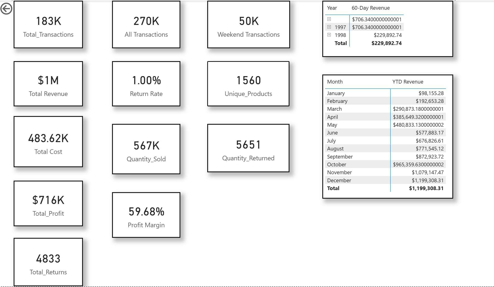
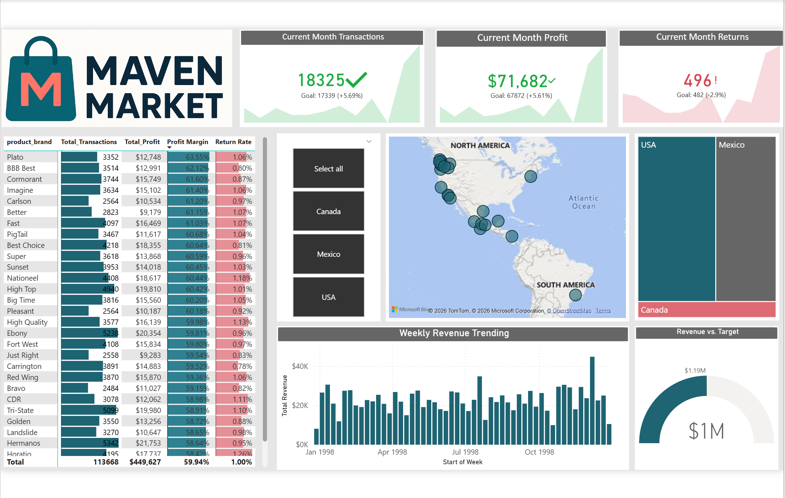

# Maven Market Sales Dashboard (Power BI)

## Project Overview
This project is a Power BI dashboard built using the Maven Market dataset. 
The dashboard analyzes sales performance, revenue trends, profit, returns, 
and product performance across different regions.

The goal of this project is to demonstrate data analysis, data modeling, 
and dashboard development skills using Power BI.

---

## Business Problem

Retail businesses need to monitor sales performance, profitability, and product returns across different regions and product brands. However, raw transaction data makes it difficult to quickly understand business performance and identify key trends.

This Power BI dashboard helps analyze Maven Market's sales data by tracking key performance indicators such as revenue, profit, transactions, return rate, and product performance. 

The objective of this dashboard is to provide clear insights into business performance, identify high-performing products and regions, and support data-driven decision making.

## Key Metrics
The dashboard tracks important business KPIs such as:

- Total Transactions
- Total Revenue
- Total Profit
- Profit Margin
- Return Rate
- Quantity Sold
- Quantity Returned
- Unique Products

---

## Dashboard Features

### 1. Sales Performance Dashboard
Provides an overview of:

- Total transactions
- Total revenue
- Profit margin
- Quantity sold and returned
- Weekend transactions
- Revenue trends

## Business Insights

• The business generated approximately $1.19M in total revenue.

• The overall profit is around $716K, resulting in a strong profit margin of nearly 59%.

• The return rate is approximately 1%, indicating that product returns are relatively low compared to total sales.

• A total of 183K transactions were recorded, with over 567K units sold.

• Around 5,651 units were returned, which aligns with the 1% return rate.

• The business offers 1,560 unique products, indicating a diverse product catalog.

• Monthly revenue shows consistent growth throughout the year, reaching its highest value in December.

• The majority of sales are generated from the USA compared to Canada and Mexico.

• Some product brands perform significantly better in terms of total profit and transactions.

• Weekly revenue trends show fluctuations but overall stable sales performance across the year.

---

## Tools Used

- Power BI
- Data Modeling
- DAX
- Data Visualization

---

## Dashboard Preview

### Dashboard 1

### Dashboard 2

---

## Key Performance Indicators

- Total Revenue: $1.19M
- Total Profit: $716K
- Profit Margin: 59.68%
- Total Transactions: 183K
- Quantity Sold: 567K
- Return Rate: 1%
- Unique Products: 1560

---

## Files Included

- `Himani project.pbix` → Power BI report file
- `dashboard1.png` → Dashboard preview
- `dashboard2.png` → Dashboard preview

---

## Author

Himani Mehra
